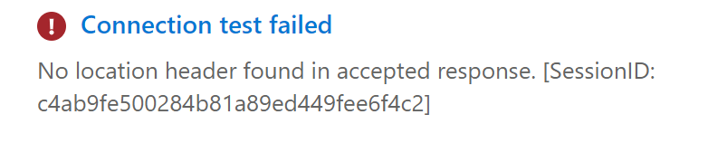
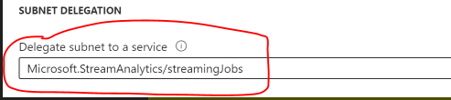
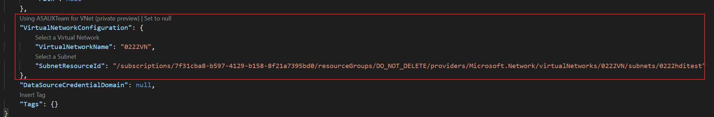

#  VNET Support in Standard SKU Private Preview

## Important Information to Note 
### Prerequisites:
- Make sure your subscription has been whitelisted for the feature. If not, please create an [issue](https://github.com/microsoft/vscode-asa/issues/new?assignees=&labels=&template=swift_prpr.md&title=%5BSWIFT%5D+Subscription+whitelist) here. Please wait until your issue is resolved. 
- Available regions for private preview: **West US & North Europe**
- Create or prepare your VNET: please note that your VNET and ASA job must be in the <u>**same region and same subscription**</u> for this private preview.

### Limitations in this private preview:
- Customer subnet range cannot collide with ASA subnet range.  
    - Avoid IP range 10.0.0.0 to 10.0.255.255 as it is used by ASA.
- When gated preview is complete and you are ready to delete your VNET/subnet, let us know please as we need to delete the SAL before you delete your VNET/subnet.
- If you want to test scaling, please setup the job with >6 SUs 
    - There is a known scaling issue for jobs running with 1,3,6 SUs
- When test connection and sample data right after creating a job, customer might encounter errors like below (just retry after one or two minutes)

    

## Setting up your Azure Stream Analytics Job
1. [Install VS Code and ASA Tools extension](https://learn.microsoft.com/en-us/azure/stream-analytics/quick-create-visual-studio-code#prerequisites) if you haven’t done so already. You need to install **ASA Tools extenion of version 1.4.3 or later** to use SWIFT private preview feature.

2. Create your job in [VS Code](https://learn.microsoft.com/en-us/azure/stream-analytics/quick-create-visual-studio-code) as you would do for any other ASA job.

    ---

    **NOTE**

    Azure portal and Visual Studio Code will have a 1:1 mapping from an experience standpoint for public preview and beyond. For gated preview, scope has been limited to VSCode.

    ---
 
3. Create or prepare your VNET, please remember your VNET must be in the same region and subscription as your ASA job.

4. Add a subnet to your VNET.

5. Within your subnet, calculate the IP range required to support your ASA workload:

    ---

    **Make sure the subnet range does not collide with ASA subnet range (i.e. do not use subnet range 10.0.0.0/16).**

    Calculating the IP range:
    - 5 IP addresses for Azure Networking
    - 1 IP address is required for S&T for up to 10 jobs per subnet
    - 2 IP addresses are required for every 6 SUs [2 IP addresses required per streaming node] 

    ---

6. Before saving, delegate the subnet to the ASA service inside your VNET, see [Add or remove a subnet delegation in an Azure virtual network | Microsoft Docs](https://learn.microsoft.com/en-us/azure/virtual-network/manage-subnet-delegation).

    

 
7. Reference a subnet in your ASA job [this step tells your job that it must work with a subnet]

    - Within the JobConfig.json, setup your VirtualNetworkConfiguration as below:
    
    
 
 
8. After your ASA job is submitted, test connection and sample data should be performed through Azure portal. 

